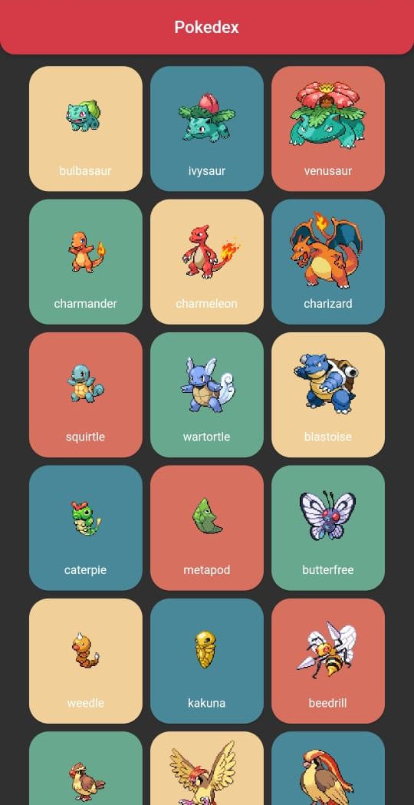
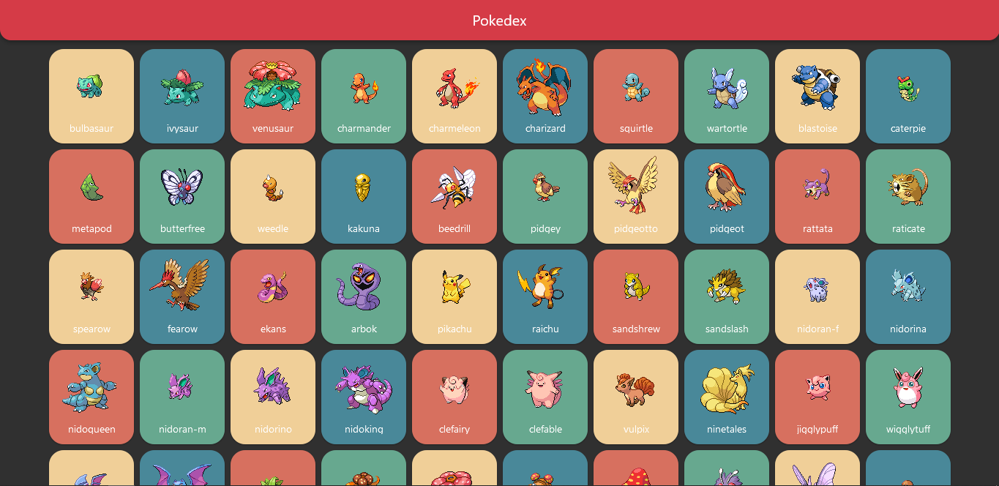
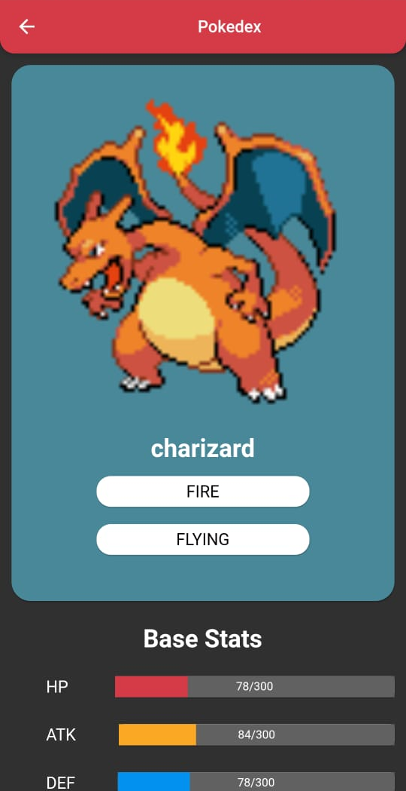
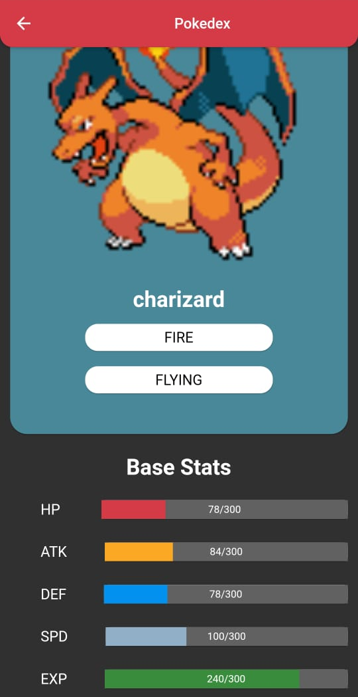
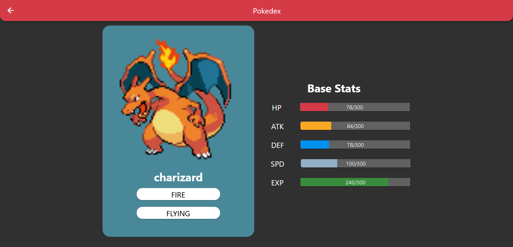

# Pokedex

## Uma Pokedex, para Android e Web, em Flutter, utilizando a API [PokeAPI](pokeapi.co).

### Como executar

É possível executar a Pokedex de duas formas:
 - Em um aparelho Android
 - Pelo Navegador

### Executando em um aparelho Android

Para executar no seu aparelho Android, é necessário instalar o arquivo app-armeabi-v7a-release.apk, localizado no diretório apk.

### Executando no Navegador

Para executar no seu navegador, basta acessar este [link](https://felipebastoss.github.io/#/).

### Visualizando a aplicação

A aplicação é composta por duas telas:
  - A pokedex, contendo os 100 primeiros Pokemons obtidos atráves da API.
  - Uma tela para o Pokemon selecionado, contendo suas estatísticas base.
  
A Pokedex será visualizada da seguinte forma num aparelho Android:

E será visualizada assim na versão WEB:

A tela de Pokemon será visualizada assim na versão para Android:

E será visualizada assim na versão WEB:

